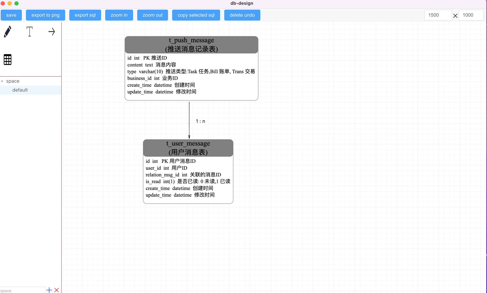

# db-design

## install cnpm if you need

```text
npm install -g cnpm --registry=https://registry.npmmirror.com
```

## local start

1. cnpm install
2. npm run electron:serve

## effect picture



## contact


## Licence
MIT
